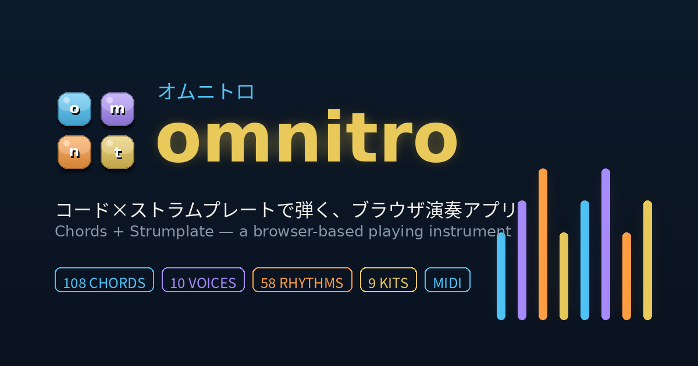

# omnitro（オムニトロ）



**コードボタン × ストラムプレートで弾く、ブラウザ演奏アプリ。**
インストール不要、ブラウザだけで演奏できます。PWA対応でホーム画面に追加すればアプリのように使えます。

▶ **公開ページ**: https://egoaid.github.io/omnitro/

---

## 目次

- [特徴](#特徴)
- [使い方](#使い方)
- [PWAとしてインストール](#pwaとしてインストール)
- [ファイル構成](#ファイル構成)
- [技術スタック](#技術スタック)
- [ライセンス](#ライセンス)
- [Features (English)](#features-english)
- [License (English)](#license-english)

---

## 特徴

- **全108コード** — 12ルート × 9タイプ（MAJ / MIN / 7 / MAJ7 / MIN7 / DIM / AUG / SUS4 / ADD9）
- **ストラムプレート** — 指でなぞって弾く、独自の音配列ロジックによるアルペジオ演奏
- **10種類のボイス** — OMNI1, OMNI2, HARP, CHEAP, SYNTH, FLUTE, GUITAR, FM PIANO, ORGAN, VIBES
- **リズムマシン** — 58種類の内蔵パターン × 9種類のドラムキット、専用のRHYTHM EDITOR / KIT EDITORで自作・保存も可能
- **録音 & MIX STUDIO** — 演奏（OMNI）・ドラム・マイク（VOCAL）を個別ステムで同時録音し、プリセット付きのミキサーで書き出し
- **PCキーボード演奏** — マウス操作に加え、キーボードでもコードボタンを演奏可能
- **MIDI対応** — MIDIキーボードでの演奏に対応。「MIDI STRUM MODE」ONで、鍵盤演奏を現在選択中のコードの音だけに強制マッピングし、ストラムプレートをそのまま鍵盤で弾ける
- **PWA対応** — ホーム画面に追加してアプリのように利用可能（オフライン対応）
- **日本語 / English** — アプリ内マニュアルは日英切り替え対応

アプリ内の「📖 MANUAL」ボタンから、詳しい取扱説明書（日本語/English）を開けます。

---

## 使い方

1. 左側のコードボタンでコードを選ぶ（複数ボタン同時押しで複雑なコードにも対応）
2. 右側のストラムプレートを指でなぞって演奏
3. SETTINGSからボイス・リズム・録音などを設定

詳細はアプリ内マニュアルを参照してください。

---

## PWAとしてインストール

- **Android / デスクトップ Chrome**: アドレスバーの「インストール」アイコン、またはメニューから「アプリをインストール」
- **iOS Safari**: 共有ボタン →「ホーム画面に追加」

一度読み込めば、Service Workerによりオフラインでも起動できます。

---

## ファイル構成


```
.
├── index.html              # アプリ本体
├── manifest.json           # PWAマニフェスト
├── sw.js                   # Service Worker（オフライン対応）
├── icons/
│   ├── icon-192.png            # アプリアイコン
│   ├── icon-512.png            # アプリアイコン
│   ├── icon-maskable-512.png   # Android向けマスカブルアイコン
│   ├── favicon-32.png          # ファビコン
│   └── og-image.png            # SNSシェア用OGP画像
├── LICENSE                 # ライセンス条文
└── README.md                # このファイル
```

> Service Workerはブラウザの仕様上、単体のHTMLファイルに埋め込むことができないため、`sw.js`は独立したファイルとして`index.html`と同じ階層に置く必要があります。

---

## 技術スタック

- **Web Audio API**（ネイティブ）— ストラムプレート音源・ドラム合成・エフェクト処理
- **[Tone.js](https://tonejs.github.io/) v14.8.49** — コード保持音・スケジューリング
- **Web MIDI API** — MIDIキーボード入力
- 依存パッケージのビルド不要、単一HTMLファイルで完結

---

## ライセンス

本アプリ（コード・音色／音源・素材一式）の著作権は作者（Takeshi Kawamoto）に帰属し、**All Rights Reserved**（独自ライセンス）です。詳細は [`LICENSE`](./LICENSE) を参照してください。

要点：

- ❌ 本アプリ自体の複製・改変・再配布・販売は、**非営利であっても禁止**
- ❌ 本アプリの音色（ボイス）をサンプリングし、音源・サンプルパック等として配布・販売することも禁止
- ✅ 本アプリを使って制作した楽曲などの**成果物の商用利用は自由**

© 2026 Takeshi Kawamoto. All rights reserved.

---
---

## Features (English)

**omnitro** is a browser-based instrument played with chord buttons and a strumplate — no install required. It's PWA-ready, so you can add it to your home screen and use it like a native app.

- **108 chords** — 12 roots × 9 types (MAJ / MIN / 7 / MAJ7 / MIN7 / DIM / AUG / SUS4 / ADD9)
- **Strumplate** — run your finger across it for a cascading arpeggio, using a distinctive note-layout logic
- **10 voices** — OMNI1, OMNI2, HARP, CHEAP, SYNTH, FLUTE, GUITAR, FM PIANO, ORGAN, VIBES
- **Rhythm machine** — 58 built-in patterns × 9 drum kits, with a full Rhythm Editor / Kit Editor for creating and saving your own
- **Recording & Mix Studio** — record instrument (OMNI), drums, and mic (VOCAL) as separate stems simultaneously, then mix down with presets and export
- **PC keyboard play** — play chord buttons from your keyboard, not just the mouse
- **MIDI support** — play from a MIDI keyboard; turn on "MIDI STRUM MODE" to force every note into the currently selected chord's strumplate layout, effectively playing the strumplate from your MIDI keyboard
- **PWA-ready** — installable, works offline after first load
- **Japanese / English** — the in-app manual switches between both languages

Open the in-app manual anytime from the "📖 MANUAL" button in Settings.

### Running it

Just open `index.html` in a browser, or host all the files listed above together (e.g. via GitHub Pages) for the installable PWA experience.

### Tech stack

- Native **Web Audio API** for the strumplate synth, drum synthesis, and effects
- **[Tone.js](https://tonejs.github.io/) v14.8.49** for held-chord voices and scheduling
- **Web MIDI API** for MIDI keyboard input
- Single HTML file, no build step required

---

## License (English)

This app (code, voices/sounds, and all assets) is copyrighted by the author (Takeshi Kawamoto). **All rights reserved** — see [`LICENSE`](./LICENSE) for the full terms.

Summary:

- ❌ Copying, modifying, redistributing, or selling the app itself is prohibited, **even non-commercially**
- ❌ Sampling or extracting this app's voices/sounds to distribute or sell (e.g. as a sound library or sample pack) is also prohibited
- ✅ Songs and other works you create using this app are **yours to use freely, including commercially**

© 2026 Takeshi Kawamoto. All rights reserved.
