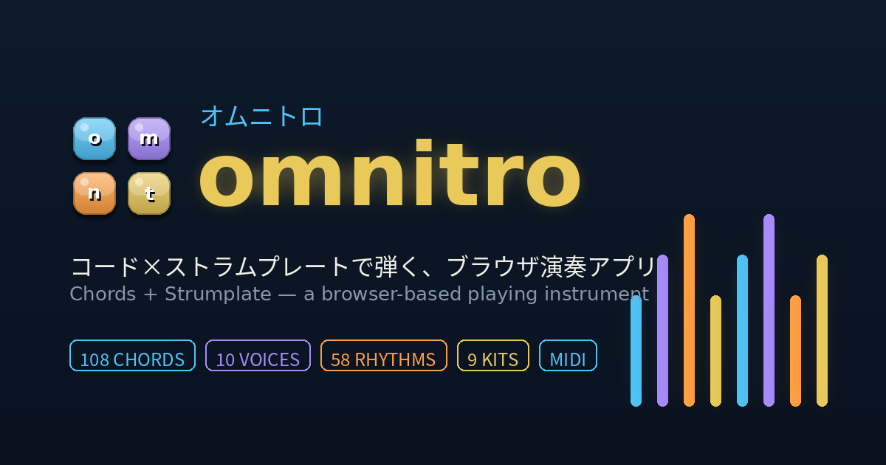

# omnitro（オムニトロ）

**コードボタン × ストラムプレートで弾く、ブラウザ演奏アプリ。**
インストール不要、ブラウザだけで演奏できます。PWA対応でホーム画面に追加すればアプリのように使えます。

▶ **今すぐ演奏する**: https://egoaid.github.io/omnitro/

---

## 目次

- [特徴](#特徴)
- [使い方](#使い方)
- [既知の制限](#既知の制限)
- [PWAとしてインストール](#pwaとしてインストール)
- [ライセンス](#ライセンス)
- [Features (English)](#features-english)
- [License (English)](#license-english)

---

## 特徴

- **全108コード** — 12ルート × 9タイプ（MAJ / MIN / 7 / MAJ7 / MIN7 / DIM / AUG / SUS4 / ADD9）
- **ストラムプレート** — 指でなぞって弾く、独自の音配列ロジックによるアルペジオ演奏
- **10種類のボイス** — OMNI1, OMNI2, HARP, CHEAP, SYNTH, FLUTE, GUITAR, FM PIANO, ORGAN, VIBES
- **リズムマシン** — 58種類の内蔵パターン × 9種類のドラムキット、専用のRHYTHM EDITOR / KIT EDITORで自作・保存も可能
- **INTRO / FILL / ENDING** — 曲の入り・つなぎのフィルイン・締めくくりを自動生成。再生のたびに少しずつ違う自然な演奏になります。それぞれ個別にON/OFFできます
- **録音 & MIX STUDIO** — 演奏（OMNI）・ドラム・マイク（MIC）を個別ステムで同時録音し、プリセット付きのミキサーで書き出し
- **PCキーボード演奏** — マウス操作に加え、キーボードでもコードボタンを演奏可能。ライブ演奏中に便利なショートカットも用意しています（<kbd>Space</kbd>：RHYTHM開始/停止、<kbd>B</kbd>：FILL発動、<kbd>C</kbd>：RANDOM発動）
- **MIDI対応** — MIDIキーボードでの演奏に対応。「MIDI STRUM MODE」ONで、鍵盤演奏を現在選択中のコードの音だけに強制マッピングし、ストラムプレートをそのまま鍵盤で弾けます（※Safari／iPhone・iPadは非対応。後述）
- **PWA対応** — ホーム画面に追加してアプリのように利用可能（オフライン対応）
- **画面スリープ抑制** — 演奏中にスマートフォンの画面が自動でスリープしないよう抑制します（対応ブラウザのみ）
- **日本語 / English** — アプリ内マニュアルは日英切り替え対応

アプリ内の「📖 MANUAL」ボタンから、詳しい取扱説明書（日本語/English）を開けます。使い方に迷ったら、まずはこちらをご覧ください。

---

## 使い方

1. 左側のコードボタンでコードを選ぶ（複数ボタン同時押しで複雑なコードにも対応）
2. 右側のストラムプレートを指でなぞって演奏
3. SETTINGSからボイス・リズム・録音などを設定

詳細はアプリ内マニュアルを参照してください。

---

## 既知の制限

- **Safari（iPhone・iPad・Macのすべて）ではMIDIキーボードが使えません。** Web MIDI APIにAppleが対応していないためです。iOS/iPadOSでは、Chrome・Firefoxなど他のブラウザアプリも内部エンジンはSafariと同じ（WebKit）ため、同様にMIDIキーボードは認識されません。MIDIキーボードを使いたい場合は、Windows／macOS／AndroidのChrome・Edge・Firefox等をご利用ください。
- PCキーボード演奏・マウス／タッチでのコード演奏・ストラムプレートなど、MIDI以外の機能はSafari／iOSでも問題なく動作します。

---

## PWAとしてインストール

- **Android / デスクトップ Chrome**: アドレスバーの「インストール」アイコン、またはメニューから「アプリをインストール」
- **iOS Safari**: 共有ボタン →「ホーム画面に追加」

一度読み込めば、オフラインでも起動できます。

---

## ライセンス

本アプリ（コード・音色／音源・素材一式）の著作権は作者に帰属します。詳細は [`LICENSE`](./LICENSE) を参照してください。

要点：

- ❌ 本アプリ自体の複製・改変・再配布・販売は、**非営利であっても禁止**
- ❌ 本アプリの音色（ボイス）をサンプリングし、音源・サンプルパック等として配布・販売することも禁止
- ✅ 本アプリを使って制作した楽曲などの**成果物の商用利用は自由**

© 2026 egoaid

---

## Features (English)

**omnitro** is a browser-based instrument played with chord buttons and a strumplate — no install required. It's PWA-ready, so you can add it to your home screen and use it like a native app.

- **108 chords** — 12 roots × 9 types (MAJ / MIN / 7 / MAJ7 / MIN7 / DIM / AUG / SUS4 / ADD9)
- **Strumplate** — run your finger across it for a cascading arpeggio, using a distinctive note-layout logic
- **10 voices** — OMNI1, OMNI2, HARP, CHEAP, SYNTH, FLUTE, GUITAR, FM PIANO, ORGAN, VIBES
- **Rhythm machine** — 58 built-in patterns × 9 drum kits, with a full Rhythm Editor / Kit Editor for creating and saving your own
- **Intro / Fill / Ending** — automatically generated arrangement passages that ease into, punctuate, and wrap up your groove. Each one plays a little differently, and each can be toggled on/off independently
- **Recording & Mix Studio** — record instrument (OMNI), drums, and mic (MIC) as separate stems simultaneously, then mix down with presets and export
- **PC keyboard play** — play chord buttons from your keyboard, not just the mouse. Handy shortcuts for live playing too (<kbd>Space</kbd>: start/stop RHYTHM, <kbd>B</kbd>: trigger FILL, <kbd>C</kbd>: trigger RANDOM)
- **MIDI support** — play from a MIDI keyboard; turn on "MIDI STRUM MODE" to force every note into the currently selected chord's strumplate layout, effectively playing the strumplate from your MIDI keyboard (*not supported on Safari/iPhone/iPad — see below*)
- **PWA-ready** — installable, works offline after first load
- **Screen sleep prevention** — keeps your phone's screen from auto-locking while you play (supported browsers only)
- **Japanese / English** — the in-app manual switches between both languages

Open the in-app manual anytime from the "📖 MANUAL" button in Settings — it's the best place to start if you're not sure how something works.

### Known limitations

- **MIDI keyboards don't work on Safari (iPhone, iPad, or Mac).** Apple has not implemented the Web MIDI API in WebKit. Since every browser on iOS/iPadOS — including Chrome and Firefox — is required to use WebKit under the hood, no browser on iPhone/iPad can access a MIDI keyboard. To use a MIDI keyboard, use Chrome, Edge, or Firefox on Windows, macOS, or Android.
- Everything else — PC keyboard play, mouse/touch chord play, the strumplate, recording, etc. — works fine on Safari/iOS.

### Running it

Just open the app in a browser, or install it as a PWA for the full offline, home-screen-app experience (see "Installing as a PWA" above).

### Tech stack

- Native **Web Audio API** for the strumplate synth, drum synthesis, and effects
- **[Tone.js](https://tonejs.github.io/)** for held-chord voices and scheduling
- **Web MIDI API** for MIDI keyboard input

---

## License (English)

This app (code, voices/sounds, and all assets) is copyrighted by the author. See [`LICENSE`](./LICENSE) for the full terms.

Summary:

- ❌ Copying, modifying, redistributing, or selling the app itself is prohibited, **even non-commercially**
- ❌ Sampling or extracting this app's voices/sounds to distribute or sell (e.g. as a sound library or sample pack) is also prohibited
- ✅ Songs and other works you create using this app are **yours to use freely, including commercially**

© 2026 egoaid
